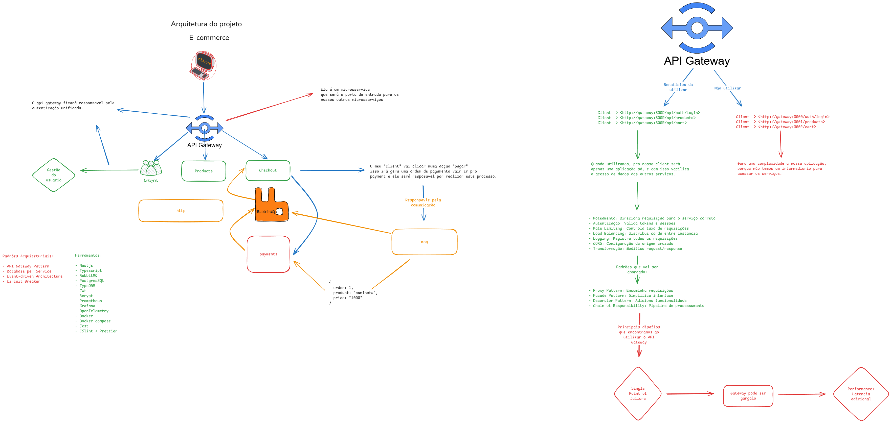

# E-commerce Microservices

## 📋 Sobre o Projeto

Este é um sistema de e-commerce desenvolvido com arquitetura de microserviços, utilizando NestJS como framework principal. A aplicação foi projetada para ser escalável, resiliente e de fácil manutenção, seguindo as melhores práticas de desenvolvimento de software.

## 🏗️ Arquitetura

A aplicação segue o padrão de arquitetura de microserviços, onde cada serviço é independente e responsável por uma funcionalidade específica do negócio. O API Gateway atua como ponto de entrada único, roteando as requisições para os serviços correspondentes.



## 🚀 Tecnologias

- **NestJS** - Framework Node.js para construção de aplicações server-side eficientes e escaláveis
- **TypeScript** - Superset JavaScript que adiciona tipagem estática
- **Microservices** - Arquitetura distribuída para maior escalabilidade

## 📦 Serviços

- **API Gateway** - Ponto de entrada único para todas as requisições, gerenciando autenticação, roteamento e comunicação entre microserviços

## 🛠️ Como Executar

```bash
# Navegue até o serviço desejado
cd api-gateway

# Instale as dependências
npm install

# Execute em modo de desenvolvimento
npm run start:dev
```

## 📚 Documentação

Cada serviço possui sua própria documentação Swagger disponível em `/docs`.

---

Desenvolvido com ❤️ usando NestJS
